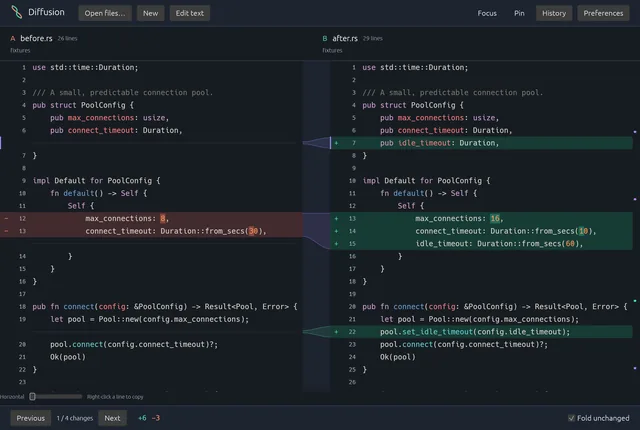
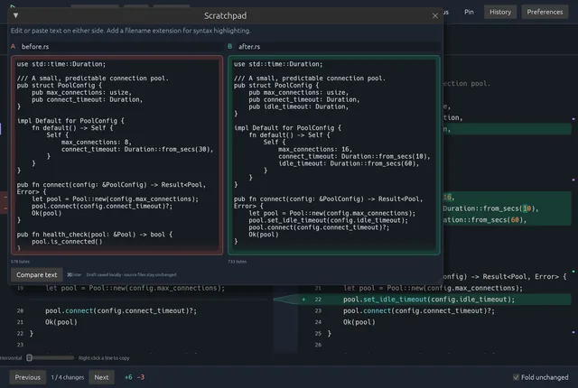
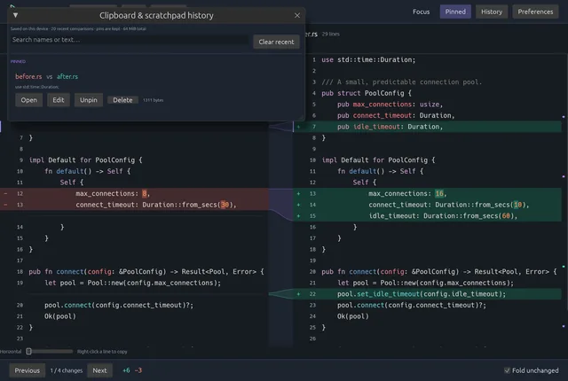

<div align="center">

# ◈ Diffusion

### See the change. Lose the noise.

**A fast, native, actually-beautiful diff tool built in Rust.**

Side-by-side comparison without the visual clutter, browser tabs, or subscription tax.

[](https://www.rust-lang.org/)


</div>

---

## 📸 Screenshots

Click a screenshot to view it at full size.

<p align="center">
  <a href="docs/screenshots/comparison.webp">
    
  </a>
</p>

<p align="center">
  <a href="docs/screenshots/scratchpad.webp">
    
  </a>
</p>

<p align="center">
  <a href="docs/screenshots/history.webp">
    
  </a>
</p>

---

> **Diffusion exists because looking at a diff shouldn't feel like reading a stack trace through a spreadsheet.**

Most diff tools are either buried inside an IDE, stuck in a terminal, visually hostile, or attached to another monthly subscription.

Diffusion is the alternative: a focused desktop application designed specifically for understanding **what changed**.

Fast startup. Native performance. Clean typography. Clear visual hierarchy. No nonsense.

---

## ✦ What is Diffusion?

Diffusion is a native file comparison application built around one simple idea:

**Differences should be immediately understandable.**

Drop in two files, open a change set, and Diffusion turns raw modifications into a visual workspace designed for humans instead of parsers.

```text
BEFORE                         AFTER

fn deploy() {                  fn deploy() {
    build();                       build();
-   push();                    +   test();
                               +   push();
}                              }
```

Except, you know...

**way prettier than that.**

---

## ⚡ Built for the "what the hell changed?" moment

Diffusion is designed for the situations every developer eventually hits:

- Comparing two versions of the same file
- Reviewing generated code before accepting it
- Inspecting AI-assisted changes
- Checking configuration differences
- Comparing files outside of Git
- Understanding a refactor without opening an entire IDE
- Figuring out exactly what changed between two mysterious copies named `final`, `final2`, and `final_ACTUAL`

You shouldn't need a full development environment just to answer:

> **"What's different between these two things?"**

---

## ✨ Core Experience

### Split Diff View

A clean side-by-side comparison keeps both versions visible while additions, deletions, and modifications remain visually connected.

No wall of red and green.

No fighting your editor.

Just the change.

### Intelligent Change Highlighting

Diffusion emphasizes the smallest meaningful change instead of treating an entire modified line as equally important.

```diff
- connection_timeout = 5000
+ connection_timeout = 15000
```

Your eyes should land on **`5000 → 15000`**, not hunt for it.

### Synchronized Navigation

Both sides move together so related code stays aligned as you move through a file.

Changes become landmarks instead of interruptions.

### Change Navigation

Jump directly between modifications rather than scrolling around trying to find the next highlighted line.

```text
        ↑ Previous Change

             4 / 17

         Next Change ↓
```

### Syntax-Aware Presentation

Source code should still look like source code.

Diffusion is designed to preserve readable syntax presentation while layering diff information on top instead of burying everything under diff colors.

### Native Desktop Experience

Diffusion isn't a web page wearing a desktop-app trench coat.

The goal is a lightweight native application with fast startup, smooth interaction, and minimal overhead.

---

## 🧠 Designed for Modern Development

The way we write software has changed.

AI coding tools can generate enormous changes in seconds.

That makes **understanding those changes** more important than ever.

Diffusion is being built with workflows like these in mind:

```text
AI generates change
        │
        ▼
    DIFFUSION
        │
        ├── What changed?
        ├── Where did it change?
        ├── Was anything unexpectedly removed?
        ├── Did configuration change?
        └── Do I actually want this?
        │
        ▼
   Ship with confidence
```

Generating code is getting easier.

**Reviewing it shouldn't get harder.**

---

## ◈ The Philosophy

Diffusion follows a few rules.

### 01 — The content comes first

The interface should disappear while you're reading.

### 02 — Color has meaning

Highlight differences, not the entire application.

### 03 — Density without clutter

Developer tools need information density.

They don't need visual chaos.

### 04 — Fast enough to become muscle memory

Opening Diffusion should feel closer to opening a terminal than launching an IDE.

### 05 — A developer utility can still be beautiful

Functional and gorgeous are not mutually exclusive.

We have the technology.

---

## 🦀 Why Rust?

Because a diff viewer has no business consuming half your laptop.

Rust gives Diffusion a foundation built around:

- Native performance
- Low memory overhead
- Fast filesystem operations
- Safe concurrency
- Cross-platform potential
- Small, distributable binaries

It also gives me an excuse to write more Rust.

Which is arguably the real reason.

---

## 🖥 Platform Support

| Platform |       Status        |
| -------- | :-----------------: |
| macOS    |         ✅          |
| Linux    | ✅ / In Development |
| Windows  |      🔮 Future      |

The goal is to keep platform-specific assumptions isolated so Diffusion can remain genuinely portable.

---

## 🚀 Getting Started

### Requirements

You'll need a recent stable Rust toolchain.

If Rust isn't installed:

```bash
curl --proto '=https' --tlsv1.2 -sSf https://sh.rustup.rs | sh
```

Then clone Diffusion:

```bash
git clone https://github.com/Rippley777/diffusion.git
cd diffusion
```

Run it:

```bash
cargo run
```

Or build an optimized release:

```bash
cargo build --release
```

The compiled binary will be available under:

```text
target/release/
```

> Platform-specific development packages may also be required depending on your operating system and the GUI backend currently in use.

### Transfer to another Mac

On a Mac with Rust installed, create an optimized application bundle and ZIP:

```bash
bash scripts/package-macos.sh
```

The archive is written to `target/macos/arm64/` on Apple Silicon or
`target/macos/x86_64/` on Intel. Transfer the ZIP to a Mac with the same processor
architecture, unzip it, and drag `Diffusion.app` into Applications. The receiving
Mac does not need Rust or the source repository. The bundle targets macOS 11 or
later; compatibility with older systems should be checked on the receiving Mac.

To build for a different processor architecture, install its Rust target first:

```bash
rustup target add x86_64-apple-darwin
bash scripts/package-macos.sh x86_64-apple-darwin
# For Apple Silicon, use aarch64-apple-darwin instead.
```

These local builds are ad-hoc signed, without Apple notarization. If macOS blocks
the transferred app, try opening it once, then use **System Settings → Privacy &
Security → Open Anyway** and confirm. Public distribution would require a
Developer ID signature and notarization.

---

## 🗺 Roadmap

Diffusion is under active development.

Some of the ideas being explored:

- [ ] Beautiful side-by-side text diffs
- [ ] Inline diff mode
- [ ] Drag-and-drop file comparison
- [ ] Folder / directory comparison
- [ ] Recent comparison history
- [ ] Git repository awareness
- [ ] Compare working tree against `HEAD`
- [ ] Commit-to-commit comparison
- [ ] Branch comparison
- [ ] Image comparison
- [ ] JSON-aware structural diffs
- [ ] YAML / configuration-aware diffs
- [ ] Ignore whitespace / formatting-only changes
- [ ] Character-level change highlighting
- [ ] Search within comparisons
- [ ] Keyboard-first navigation
- [ ] Dark and light themes
- [ ] Open from terminal
- [ ] Shell / Finder integration
- [ ] External Git difftool integration
- [ ] Merge conflict assistance
- [ ] Three-way merge view
- [ ] AI-assisted change summaries

And probably several features caused by me getting annoyed at another diff tool.

---

## 🔬 Where the name comes from

**Diffusion** is the movement of something from an area of higher concentration toward an area of lower concentration until the distinction begins to resolve.

This app does roughly the opposite.

It takes two things that look almost identical...

and makes every difference impossible to miss.

---

## 🛠 Development

Clone the repository:

```bash
git clone https://github.com/Rippley777/diffusion.git
cd diffusion
```

Check the project:

```bash
cargo check
```

Run the test suite:

```bash
cargo test
```

Run the application:

```bash
cargo run
```

Build optimized:

```bash
cargo build --release
```

---

## 🤝 Contributing

Diffusion is primarily being built as a tool I actually want to use.

That said, good ideas are good ideas.

Issues, bug reports, platform fixes, performance improvements, and thoughtful pull requests are welcome.

If you're proposing a feature, the bar is simple:

> **Does this make understanding a change easier?**

If yes, it probably belongs here.

---

## ⚠️ Project Status

Diffusion is currently under active development.

APIs, interfaces, workflows, and architectural decisions may change while the core experience is being refined.

In other words:

```text
if (something_breaks) {
    congratulations();
    you_found_the_edge();
}
```

---

<div align="center">

## Stop squinting at diffs.

### Let them diffuse.

**[View the Repository](https://github.com/Rippley777/diffusion)**

Built with 🦀, unreasonable UI standards, and a refusal to subscribe to another developer tool.

</div>

## License

[MIT NON-AI License](LICENSE). This custom, source-available license permits use, modification, and redistribution subject to its terms, but **prohibits all AI/ML use of the code**, including training, inference, AI integrations, and supplying the code to AI coding tools, unless separately authorized in writing by the applicable copyright holder(s). It is not the standard MIT License or an OSI-approved open-source license.

Third-party components and assets retain their own licenses. Previously granted licenses are not retroactively revoked. See the license file for the full terms.
